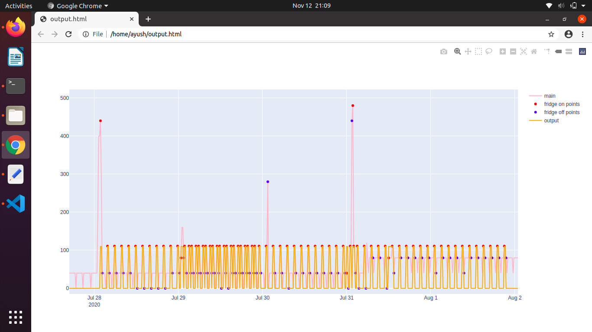
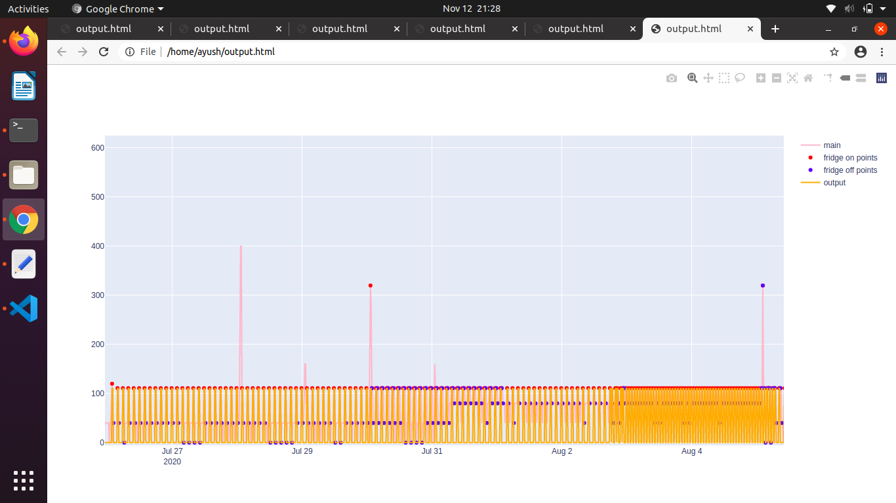
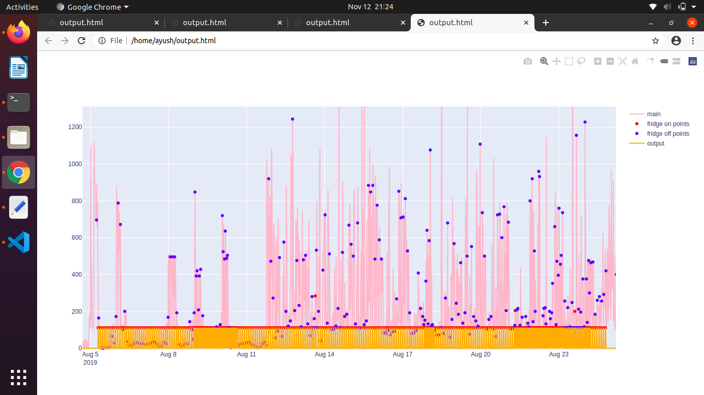
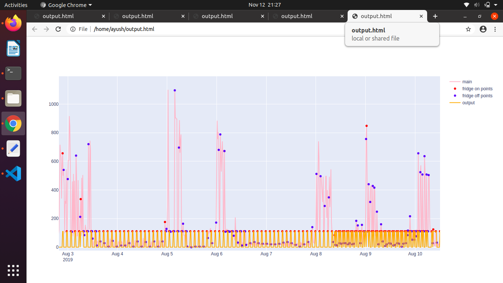
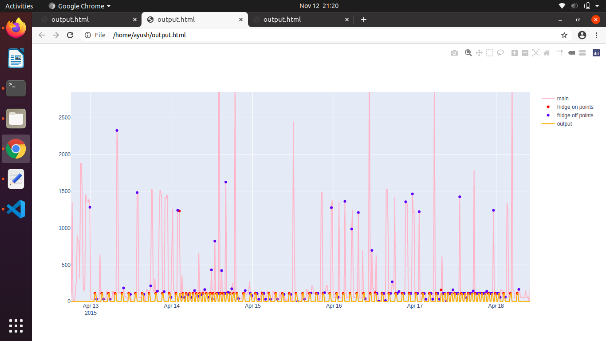
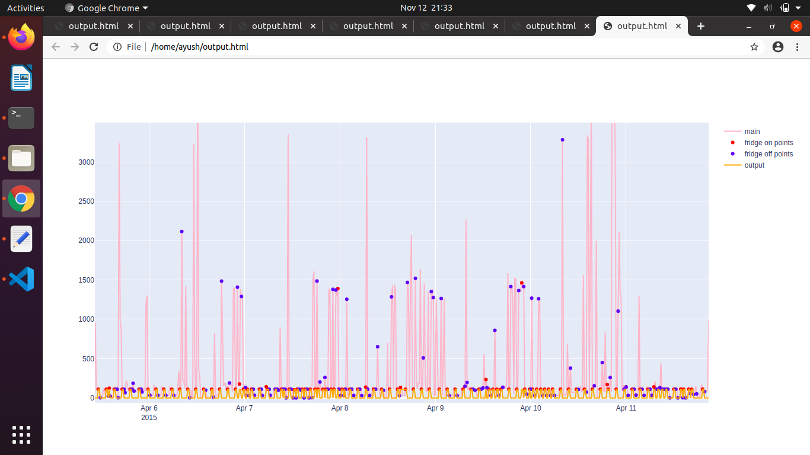

# Baseline Model for NILM
### About The Project

The objective of this project is to obtain insights on the devices being operated in the household using the mains meter reading. The meter readings are analysed using machine learning techniques to obtain valuable insights


## Getting Started
### Set-up

The code can run in any version of Python 
Install pip and install the required libs
```
sudo apt-get install python3-pip python3-venv
sudo pip install -r requirements.txt
```


### Arguments and Usage


    usage: runNilmBaselineFridge.py [-h] -m MAINS_PATH [-a APPLIANCE_PATH]
                                [-sr SAMPLING_RATE] [-v VISUALISE_RESULTS]
                                [-mo MODEL_NAME] [-r REFINE] [-e ENERGY_UNIT]
                                [-o OUTPUT_PATH] [-lt LOWER_THRESHOLD] 
								[-ut UPPER_THRESHOLD] [-vo VISUALISE_OUTPUT]


    optional arguments:
		-h, 			 --help
						show this help message and exit
						
		-m MAINS_PATH,      	--mainspath MAINSPATH
									Mains dataset path
								
		-a APPLIANCE_PATH,    	--appliance_path APPLIANCE_PATH
									Appliance dataset path
									
								
		-an APPLIANCE_NAME,    --appliance_name APPLIANCE_NAME
									Appliance name 								

		-sr SAMPLING_RATE, 	  	--sampling_rate SAMPLING_RATE
									Sampling rate in min

		-v VISUALISE_RESULTS, 	--visualise_results VISUALISE_RESULTS
									Enter false if you want to visualise the results

		-mo MODEL_NAME, 		--model_name MODEL_NAME
                        			Enter 2 for 2nd model

  		-r REFINE, 				--refine REFINE
                        			Enter 1 for delhi data and 2 for cspdcl data

		-e ENERGY_UNIT, 		--energy_unit ENERGY_UNIT
                        			Enter energy unit kWh/Wh

		-o OUTPUT_PATH, 		--output_path OUTPUT_PATH
									provide the output path where you want to store the	csv

		-lt LOWER_THRESHOLD, 	--lower_threshold LOWER_THRESHOLD
									Lower fridge power

		-ut UPPER_THRESHOLD, 	--upper_threshold UPPER_THRESHOLD
									Upper fridge power

		-vo VISUALISE_OUTPUT, 	--visualise_output VISUALISE_OUTPUT
									visualise output


### Guidelines 
The module can be executed with and wihout the ground truth data. 
<<<<<<< HEAD
1. ChattisGarh Data Fridge Disaggregation with MODEL 1 sampled at 15 Mins

2. ChattisGarh Data Fridge Disaggregation with MODEL 2 sampled at 15 Mins


3. Delhi Data Fridge Disaggregation with MODEL 1 sampled at 15 Mins

4. Delhi Data Fridge Disaggregation with MODEL 2 sampled at 15 Mins



5. DataPort Data Fridge Disaggregation with MODEL 1 sampled at 15 Mins

6. Dataport Data Fridge Disaggregation with MODEL 2 sampled at 15 Mins



=======
1. On  execution without the ground truth data

2. On execution without the ground truth data 

>>>>>>> db1f65df147c12195bd0fa71f467d8ee0bdd93cb
